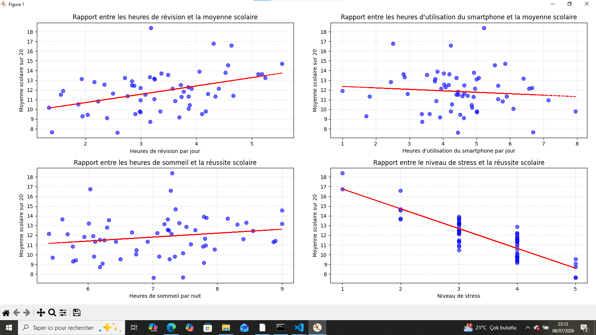

# Student Performance Correlation

Analyse exploratoire des facteurs pouvant influencer la réussite scolaire des étudiants : temps de révision, temps d'écran, heures de sommeil et niveau de stress.

## Objectif

Ce projet étudie la corrélation entre quatre variables comportementales et la moyenne scolaire (sur 20) d'un échantillon d'étudiants, à l'aide de nuages de points et de régressions linéaires simples.

## Dataset

Le fichier `data/projet_reussite_scolaire_stress_correlation_forte.csv` contient, pour chaque étudiant, les colonnes suivantes :

| Colonne | Description |
|---|---|
| `heures_revision_par_jour` | Nombre d'heures de révision par jour |
| `temps_ecran_par_jour_heures` | Temps d'utilisation du smartphone par jour (en heures) |
| `heures_sommeil_par_nuit` | Nombre d'heures de sommeil par nuit |
| `niveau_stress` | Niveau de stress auto-évalué (échelle de 1 à 5) |
| `moyenne_scolaire_sur_20` | Moyenne scolaire de l'étudiant, sur 20 |

## Méthodologie

Pour chaque variable, un nuage de points est tracé face à la moyenne scolaire, avec une droite de régression linéaire (calculée via `numpy.polyfit`) pour visualiser la tendance générale.

## Résultats



**1. Heures de révision vs moyenne scolaire**
Corrélation positive assez nette : plus le temps de révision quotidien augmente, plus la moyenne scolaire tend à être élevée.

**2. Temps d'écran vs moyenne scolaire**
Corrélation légèrement négative mais faible : le temps passé sur smartphone semble avoir un impact limité comparé aux autres facteurs, la tendance reste quasiment plate.

**3. Heures de sommeil vs moyenne scolaire**
Corrélation positive mais faible : plus de sommeil semble légèrement associé à de meilleurs résultats, sans effet très marqué.

**4. Niveau de stress vs moyenne scolaire**
Corrélation négative forte et la plus marquée du dataset : un niveau de stress élevé est clairement associé à une baisse significative de la moyenne scolaire.

## Conclusion

Sur cet échantillon, le **niveau de stress** apparaît comme le facteur le plus fortement corrélé (négativement) à la réussite scolaire, suivi par les **heures de révision** (corrélation positive). Le temps d'écran et le sommeil ont un impact visible mais plus modéré.

À noter : une corrélation ne signifie pas causalité — d'autres facteurs non mesurés dans ce dataset (méthode de travail, environnement familial, matière étudiée, etc.) peuvent influencer ces résultats.

## Outils utilisés

- Python
- pandas
- numpy
- matplotlib
- seaborn

## Utilisation

```bash
pip install pandas numpy matplotlib seaborn
python analyse.py
```

## Auteur

Derrick Octavio Jannato — [GitHub](https://github.com/derrickjannato)
